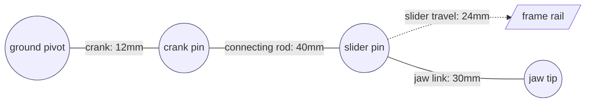

# Lecture 1 — Designing a Working Mechanism: From Concept Sketch to Articulating Assembly

> **Reading time:** ~75 minutes. **Hands-on time:** ~45 minutes (you draft your concept sketch, budget the degrees of freedom, and plan your mate scheme before opening a Part Studio).

This is the lecture that turns "I can model a part" into "I can design a thing that moves and prove it." You have spent five weeks accumulating OnShape primitives — sketches, extrudes, revolves, planes, patterns, mates, configurations. This week you assemble them into an original mechanism that articulates, and you stand in front of people who will drag it to its extremes and try to make it bind, interfere, or throw a rebuild error. Designing a mechanism is not "draw some parts and hope they fit." It has a discipline with a known order: concept sketch first, kinematic skeleton second, degrees-of-freedom budget third, mate plan fourth, and only *then* do you model parts. By the end of this lecture you will know that order, why each step exists, and how to walk a single motion through your mechanism without it binding.

## 1.1 — What "a working mechanism" actually means

A *part* has a shape. A *mechanism* has a **motion**. The whole job this week is to design the motion first and the shapes second, because if you model beautiful parts and then discover the geometry cannot move the way you intended, you throw the parts away. The motion is the design; the parts are the embodiment of it.

A working mechanism has three properties, and your capstone is judged on all three:

1. **It has exactly the intended degrees of freedom (DOF).** A door hinge has one DOF (it swings). A drawer slide has one DOF (it translates). A scissor lift has one DOF (one input collapses or extends the whole stack). If your "one-DOF" mechanism turns out to have two — because a joint you thought was fixed actually wobbles — it does not move predictably, and a reviewer will find the extra DOF by grabbing the part and shaking it.

2. **It moves through its full range without interference.** "It moves at the home position" is not the bar. The bar is "it moves through *every* position in its range and no two solids ever occupy the same space." Most mechanisms fail at the *extremes* of travel, not the middle — the gripper jaws collide when fully closed, the linkage bar passes through the frame at full rotation. You must check the extremes, not just the comfortable home pose.

3. **It is parametrically robust.** Change one driving dimension — make the link 20% longer, the bore 2mm wider — and the whole thing rebuilds without a red error and *still moves*. This is the property that separates a parametric model from a fragile shape. It is also the single thing the grader tests hardest, because it proves the model is engineered, not stumbled into.

Everything in this lecture serves those three properties. Get the motion right on paper, and the modeling is the easy part.

## 1.2 — The artifact set you bring to the review

You do not walk into a design review and start orbiting a 3D model hoping it impresses people. You bring a packet — the artifacts a reviewer reads *before* the meeting so the hour is spent on questions, not on catching up. The capstone packet has six artifacts, and they map one-to-one onto the capstone deliverables:

1. **The concept sketch + kinematic skeleton.** One page. The mechanism drawn as lines and joints — bars as lines, revolute joints as circles, sliders as little rails — with the input and the output labeled. Hand-drawn-then-photographed is fine; a clean OnShape sketch is better. This is the thing that proves you designed the *motion*, not just some parts.

2. **The degrees-of-freedom budget.** One short table or one line of the mobility equation. "Four links, four revolute joints, mobility = 1." The reviewer reads this first because it tells them what "working" means before they ask whether it works.

3. **The exploded/assembly view + BOM.** One image of all the parts and a table of what they are. The reviewer wants to see the part count and the structure (which parts are sub-assemblies) at a glance.

4. **The drawing package pointer.** Not the whole drawing — a pointer to it, plus the answer to one question: "if a machinist had only your part drawing, could they make this part?" If the answer is no, your drawing is decorative.

5. **The parametric-robustness proof.** The before/after of changing a driving variable: the model at the default value, the model at a different value, and the statement "zero rebuild errors across the change." Lecture 2 and the mini-project make this concrete; it is the artifact that most impresses a reviewer because most students have never proven it.

6. **The design walkthrough.** The written narrative: what the mechanism is, the motion it produces, the mates that produce it, and the tradeoffs you made. This is the artifact that separates designers who *understand* their model from designers who clicked until it looked right.

Bring all six. The skeleton sketch and the live assembly go on screen during the meeting; the rest are pre-reads.

## 1.3 — The design-review agenda: forty-five minutes, structured

A review that wanders is a review that does not find the binding joint. Here is the meeting, and it is the meeting you will run on Friday:

- **Minutes 0–5 — Context.** What is this mechanism *for*? What motion does it produce, driven by what input, with what consequence if it jams? One sentence of purpose, one of the motion ("a single crank rotation collapses the scissor stack by 80mm"), one of the constraint ("it has to fit in a 100mm cube and 3D-print without supports"). No CAD yet.
- **Minutes 5–12 — The skeleton walk.** You put the kinematic skeleton on screen and walk it: here is the input link, here are the joints, here is the output. You establish the *motion* before you show a single solid.
- **Minutes 12–25 — Drag one motion live.** This is the heart of the meeting. You open the live assembly and drag the input through its full range, slowly, narrating: "as I rotate the crank, the connecting rod pulls the slider, and you can see the jaw close — and here at the extreme, the clearance is 1.2mm, measured." You let the reviewers interrupt with the hard questions.
- **Minutes 25–35 — Failure modes and the extremes.** Now you go off the happy path. Where does it interfere? What is the worst-case clearance? What happens at the very end of travel? Which joint carries the load? You name the failure mode at each joint.
- **Minutes 35–42 — Parametric robustness and manufacturability.** You change a driving variable on camera and show the clean rebuild. The reviewers test whether the model is really parametric and whether the parts can actually be made.
- **Minutes 42–45 — Risk list and sign-off.** The reviewers state the risks they found, tag each **accept / fix-now / fix-later**, and assign owners. You write them down. That list is the output of the meeting.

## 1.4 — The questions a senior designer will ask

This is the part you came for. Below is the question bank. A senior designer does not ask all of these; they ask the five your skeleton makes them nervous about. Your job is to have an answer to every one *before* the meeting, so the five they pick are easy.

### Degrees of freedom and constraint

- **"How many degrees of freedom does this have, and is that what you intended?"** Every mechanism has a number; the wrong answer is "I'm not sure." For the capstone, you should be able to say "one input DOF — I rotate the crank and everything else follows" and show the mobility-equation count that proves it. If grabbing a "fixed" part wobbles it, you have an unintended DOF and that is a real bug found in the meeting, which is the entire point of the meeting.
- **"Show me an over-constrained joint."** OnShape will let you add redundant mates that *happen* to agree at the home position but fight each other when you move. The honest answer names where you were careful: "I used one Revolute here, not a Revolute plus a Cylindrical, because the second would over-constrain the joint and OnShape would flag it red the moment I dragged it."
- **"What grounds the assembly?"** Exactly one part should be Fixed (grounded), and everything else positioned relative to it through mates. "Two grounded parts" or "nothing grounded and I just dragged them into place" is a fail — the first over-constrains, the second means the parts float.

### Motion and interference

- **"Drag it to the extreme of travel. Does anything interfere?"** This is the live test. The right answer is a number: "at full closure the jaws clear by 1.2mm; I ran Interference Detection at three positions and the worst is here." If your answer is "it looks fine," the reviewer drags it themselves and finds the collision you did not check.
- **"Where does this bind?"** A mechanism that *can* reach a position where it locks up (a four-bar at its toggle point, a slider that runs off the end of its rail) has a binding failure mode. Naming it — "Grashof says this linkage is a crank-rocker, so the rocker bottoms out at 140° and that's the hard stop I designed in" — reads as someone who understands kinematics, not someone who got lucky.
- **"What's the range of motion, in real units?"** "It opens" is not an answer. "The jaw travels 24mm from fully open to fully closed, driven by 90° of crank rotation" is. Know your input range and your output range as numbers.

### Manufacturability and fits

- **"Could a machinist make this part from your drawing alone?"** The part drawing must be fully dimensioned, with the critical dimensions toleranced. If the pin diameter and the hole diameter have no tolerance, nobody knows whether the pin slides or jams. (Week 05 taught you fits; this is where it proves it stuck.)
- **"This pin goes in this hole. What's the fit?"** You should know your clearances. "The pin is 6mm nominal, the hole is 6.2mm, so there's a 0.2mm diametral clearance — a loose running fit, deliberate because this is a 3D-printed joint and FDM holes shrink." A reviewer checking whether you understand real-world tolerance asks exactly this.
- **"Can this be 3D-printed / machined as drawn?"** Overhangs without support, internal voids you cannot reach, wall thicknesses below the process minimum — these are manufacturability failures. The honest answer names the process and its constraints: "this prints flat on the bed with no overhang past 45°, so it needs no supports."

### Robustness and design intent

- **"Change the main driving dimension. Does it rebuild?"** The live parametric test. You change `#link_length` from 60 to 75 and the whole assembly rebuilds, zero errors, and *still moves*. If a feature goes red, you have a brittle reference (a sketch dimensioned to a face that moved) and you found it in the meeting.
- **"Why is your feature tree ordered the way it is?"** A senior designer reads a feature tree like a build sequence. The right answer explains the design intent: "the base extrude is first because everything references it; the mounting holes are last because I want to move them without rebuilding the body."
- **"What did you parameterize, and what did you hard-code?"** The honest answer names a tradeoff: "the link lengths are variables because they define the motion; the chamfer size is hard-coded at 0.5mm because it's cosmetic and I never need to drive it."

## 1.5 — Drag one motion: the demo that wins the room

The single most effective thing you do in the review is drag one real motion through the live assembly, on screen, and narrate the mechanism at each joint. Not a render of the motion — the actual live drag, in OnShape, where the reviewer can see the mates resolve in real time.

Here is the shape of that walk. Open the live Assembly tab. Grab the input — the crank, the handle, the actuating link — and move it slowly through a small part of its range while you talk:

> "I'm grabbing the crank here. As I rotate it about this Revolute mate" — *you point at the joint in the Mate features list* — "the connecting rod, which is pinned to the crank with a second Revolute and to the slider with a third, gets pushed down. The slider rides this Slider mate along the frame rail. Watch the jaw: it closes as the slider advances. Right now I'm at 30° of crank rotation and the jaw is half closed."

Then you drive it to the extreme and *measure live*:

> "Now I'll take it to the end of travel — full closure. The crank is at 90°, the jaw is shut. I want to show you it doesn't collide: I'll run Insert → Interference Detection." *You run it.* "Zero interferences. And here's the clearance at the tightest point" — *you use the Measure tool between the two jaw faces* — "1.2 millimeters. That's the gap I designed in so the printed parts don't bind."

Then — the moment that wins the room — you change a driving variable *while the assembly is still on screen* and let it rebuild:

> "Last thing. The jaw stroke is driven by one variable, `#crank_radius`. I'll open the Variable Studio and change it from 12 to 15 millimeters." *You edit it.* "The whole assembly regenerates — no errors — and now the jaw stroke is larger. The motion survived the change. That's the parametric robustness the mini-project asks for."

When you do that live — drag, measure, re-parameterize, all without a single red error — you have demonstrated more than any render can: that the model is a real parametric mechanism you can *operate and edit*, not a static shape you posed once. A reviewer who sees a clean live drag and a clean live rebuild stops worrying about whether the model is fragile.

## 1.6 — The concept sketch and the kinematic skeleton

Everything good about your mechanism is decided before you model a single part, on the concept sketch. This is the discipline most students skip and most regret skipping.

A **concept sketch** is the mechanism drawn as a free-body of *intent*: what moves, relative to what, driven by what. It does not need to be to scale. It needs to show the input, the output, and the linkage between them.

A **kinematic skeleton** is the concept sketch made geometric: every link is a line (or a chain of lines) of a real length, every joint is a point, and the whole thing is a single OnShape sketch you can *drag* to preview the motion before any solid exists. This is a genuinely powerful OnShape technique: build the skeleton as a sketch with the joints as coincident points and the links as fixed-length lines, leave exactly one degree of freedom under-defined (the input), and drag it. If the skeleton moves the way you want, your mechanism will too. If the skeleton binds, you just saved yourself a day of modeling parts that could never have worked.

Here is the skeleton you would draw for a slider-crank gripper, expressed as a diagram you would put in your design walkthrough:



Read it as motion: the crank rotates about the ground pivot, the crank pin sweeps a 12mm-radius circle, the connecting rod transmits that to the slider pin, the slider rides the rail, and the jaw link converts the slider travel into the jaw closing. Four moving relationships, one input. That is the design. The parts are just solids wrapped around this skeleton.

## 1.7 — The degrees-of-freedom budget (the mobility equation)

Before you model, you budget the DOF, and there is a formula for it. For a planar mechanism, the **Kutzbach / Gruebler mobility equation** is:

```
M = 3(N − 1) − 2 J1 − J2
```

where `N` is the number of links *including the ground link*, `J1` is the number of one-DOF joints (revolute pins, sliders), and `J2` is the number of two-DOF joints (a pin-in-slot, a gear-pair contact). You want `M = 1` for a single-input mechanism.

Work the slider-crank gripper from §1.6:

- Links: ground/frame, crank, connecting rod, slider, jaw — but the slider and the jaw move together as one rigid link in the simplest version, so call it **4 links** (frame, crank, rod, slider-jaw). `N = 4`.
- Joints: ground-to-crank (revolute), crank-to-rod (revolute), rod-to-slider (revolute), slider-to-frame (prismatic/slider). That is **4 one-DOF joints**. `J1 = 4`, `J2 = 0`.

```
M = 3(4 − 1) − 2(4) − 0 = 9 − 8 = 0
```

Zero. That is a *structure*, not a mechanism — it would not move. The fix tells you something real: a basic slider-crank uses 3 links + the ground (4 total) with 3 revolutes and 1 slider, but the classic mobile slider-crank is `N=4, J1=4` giving `M=1` only when one of those four joints is the *driven* input that you actively turn — the equation counts the *passive* constraint, and the input rotation is the one DOF you supply. The lesson is not the arithmetic detail; it is that **you compute this before you model**, and if it comes out to 0 or a negative number you have an over-constrained structure that will not move, and if it comes out to 2 you have a floppy mechanism with an unintended extra DOF. Budgeting the DOF on paper is how you avoid modeling a mechanism that physically cannot do what you wanted.

A reviewer who asks "how many DOF" and hears "one, and here's the mobility count" knows you designed the motion. One who hears "uh, it just kind of moves" knows you did not.

## 1.8 — Choosing the mates before you model

The DOF budget tells you *how many* and *what kind* of joints. The OnShape mate that implements each joint is a direct translation, and you decide it before modeling so you can place the **mate connectors** as you build each part:

| Skeleton joint | Physical behavior | OnShape mate | DOF it leaves |
|---|---|---|---|
| Ground pivot | a pin that rotates | **Revolute** | 1 (rotation about its axis) |
| Crank pin, rod ends | pins that rotate | **Revolute** | 1 each |
| Slider on rail | rides a straight track | **Slider** | 1 (translation along the rail) |
| Two meshing gears | coupled rotation | **Gear** (mate relation) | couples two existing revolutes |
| A pin in a curved slot | follows a path | **Pin-Slot** | 2 (slide + rotate) |
| Two parts welded solid | no motion | **Fastened** | 0 |

The discipline this forces: **place a mate connector at every joint while you model the part, at the exact point where the joint lives.** A Revolute joint needs a mate connector on the centerline of the pin hole, oriented down the axis. If you model the part with the mate connector already there — explicitly, named — assembling is a five-minute job of snapping connectors together. If you skip them, you spend assembly day fighting OnShape to infer connectors from edges, and your mates end up referencing implicit geometry that breaks the moment you change a dimension. The clean-mate-connector habit is the single biggest determinant of whether your assembly is parametrically robust.

One more rule from Week 04 that the capstone tests hard: **ground exactly one part, and build the rest of the mate scheme as a tree off it.** Pick the frame as the grounded part. Mate the crank to the frame, the rod to the crank, the slider to the rod and the frame. Each part is positioned by mates relative to the ground, never floating, never double-grounded. A mate scheme that reads as a clean tree from one ground is a mate scheme that drags smoothly and rebuilds cleanly.

## 1.9 — Building parts that survive a dimension change

A part is parametrically robust when changing a driving dimension rebuilds it without error. The failure mode is the **brittle reference**: a feature dimensioned to geometry that moves out from under it. Three habits prevent it.

**First, drive dimensions from variables, not magic numbers.** Put the dimensions that define the motion — the crank radius, the link lengths, the slider travel — into a Variable Studio as `#crank_radius`, `#rod_length`, and reference those variables in the sketches. Now one edit in one place changes the whole mechanism consistently, and there is no chance of changing the crank in one sketch and forgetting the matching dimension in another.

**Second, sketch against stable references.** Dimension a sketch to an origin plane or a named construction geometry, not to a fillet edge or a face that will move when an earlier feature changes. The classic brittle reference is dimensioning a hole to the edge of a chamfer; change the chamfer and the hole's reference vanishes and the feature goes red. Dimension the hole to the origin or to a construction line instead, and it survives.

**Third, order the feature tree like a build sequence with intent.** The base feature that everything references goes first. Dress-up features (fillets, chamfers) go near the end so they do not own references that earlier features need. Mate connectors get placed deliberately and named. A feature tree ordered this way rebuilds top-to-bottom without a feature ever looking for geometry that has not been created yet.

When the reviewer changes `#rod_length` from 40 to 50 and the assembly rebuilds clean and the gripper still grips, these three habits are why. When it goes red, one of the three was violated, and the red feature tells you which.

## 1.10 — Rehearsing the live drag

Do not improvise the live demo. The drag-one-motion walk (§1.5) is the highest-stakes ninety seconds of the review, and it involves a live model that can misbehave — a mate that suddenly over-constrains, a part that interferes at a position you did not check. Rehearse it three times before Friday:

1. **Dry run, full range, slow.** Drag the input from one extreme to the other, slowly, and watch *every* part. You are hunting for the interference or the bind you did not catch. Find it now, not in the meeting.
2. **Dry run with a fallback recording.** OnShape can lag, a regen can hiccup. Have a screen recording of a *successful* drag-and-rebuild ready to play if the live model stalls. "The live model is regenerating slowly, here's a recording of the same drag from an hour ago" is completely acceptable and far better than freezing.
3. **Dry run narrating out loud.** The words matter as much as the dragging. Practice saying "this Revolute mate is the ground pivot; as I rotate it, the connecting rod — pinned here and here — transmits the motion to the slider." Narration that names the mate and the joint reads as mastery.

The recorded 5-minute video (a capstone deliverable) is essentially this walk, edited. If you rehearse the live drag well, the video is a thirty-minute recording session, not a thirty-take ordeal.

## 1.11 — A worked transcript: the interference question

Reading the question bank is one thing; hearing how a good answer *sounds* is another. Here is a reconstructed exchange from a capstone-style review, lightly edited. The student is presenting; "R" is the reviewer.

> **R:** Drag it to full closure for me. All the way. Now — do those two jaws ever touch?
>
> **Student:** Let me take it there. *(drags the crank to 90°)* They get close — this is the tightest the mechanism gets. They don't touch, and I can prove it two ways. First, Interference Detection: *(runs it)* zero interferences across the whole assembly at this position. Second, the actual gap — *(Measure tool between the jaw faces)* 1.2 millimeters. I designed that clearance in deliberately because these print on an FDM machine and the faces swell by a couple tenths; 1.2mm gives me margin so they never fuse.
>
> **R:** You checked it at full closure. Did you check it anywhere else?
>
> **Student:** Yes — that's the part that bit me the first time. I checked three positions: home, mid-travel, and full closure. The worst clearance isn't at full closure, it's at about 70° where the connecting rod swings closest to the frame rail — 0.9mm there. That's my real minimum. It's in the postmortem section of my walkthrough with the screenshot.
>
> **R:** What happens if you make the crank longer? Does the clearance survive?
>
> **Student:** That's the risk, honestly. The clearance is *not* parametrically safe — if I push `#crank_radius` past about 16mm, the rod sweeps into the frame and Interference Detection goes red. So I documented a valid range for that variable: 10 to 16 millimeters. Inside that range it rebuilds clean and never interferes; outside it, it collides. I'd rather tell you the safe envelope than pretend any value works.

Notice what made that answer strong. The student gave a *measured* clearance, not "it looks fine"; checked the *extremes and the middle*, not just one pose; named the *worst* position honestly; and — the senior move — admitted the parametric robustness has a *bounded range* rather than overclaiming that any value works. That is the shape of every good review answer: specific, measured, honest about the limit, and tied to how the thing is actually made.

## 1.12 — Common ways students lose the review

To round out the playbook, the recurring own-goals. Each one is avoidable with preparation:

- **Orbiting the model instead of moving it.** Spinning a static assembly around so it looks pretty, never dragging the joint. The reviewer wants the *motion*. Move the mechanism, do not just admire it.
- **"It works" with no number.** "It opens and closes." How far? Driven by what input range? With what clearance at the tightest point? A mechanism described without numbers reads as a mechanism the designer never measured.
- **Hiding the unintended DOF.** Pretending the floppy joint is fine, hoping nobody grabs it. They grab it, it wobbles, and now it looks like you either did not notice or tried to slip it past. Name your loose joint first if you have one.
- **A feature tree nobody can read.** "Sketch 1, Extrude 1, Sketch 2, Fillet 3, Sketch 7…" — default names, no intent. A reviewer reads the tree to understand your design; rename your features so it reads like a build sequence.
- **No rebuild story.** "It's modeled." "Change a dimension." Red errors everywhere. A model you cannot edit is a shape, not a parametric design, and the review surfaces that in ten seconds.
- **Checking only the home position.** Demonstrating the motion at the one pose you know is safe and never going to the extremes. The reviewer goes to the extreme for you, and finds the collision. Check the extremes yourself, first.

Prepare against all six and the review becomes what it is supposed to be: a productive hour that makes your mechanism better and makes you look like someone who has designed moving things before.

## 1.13 — The mock review: the design defense's twin

The capstone week also runs a mock review, and it is worth understanding why it sits next to the live design review, because they are two views of the same skill. The design review defends a mechanism *you built*. The mock review asks you to reason about a mechanism *on the spot* and then deep-dive an OnShape technique. Both reward the same muscles: tracing a motion, naming a failure mode, defending a tradeoff with numbers, and being honest about what you do not know.

The mock review has two rounds, mirroring a real CAD-designer interview:

- **Round one — design defense (30 min).** A prompt like "design a mechanism that converts one rotation into a clamping force" or "you need a lid that opens and stays open at 90° — what's the joint?" You drive: clarify the requirement and the constraints first ("how much force, what travel, can it be powered or is it hand-driven, what's the envelope?"), sketch the skeleton, name the joints and the mates, then go deep where the interviewer pushes. Your capstone *is* one such answer — you have designed and proven a mechanism — so this round is where your six weeks pay off most directly.
- **Round two — OnShape deep-dive (20 min).** A focused drill: "this part throws a rebuild error when I change a dimension — debug it" or "this assembly is over-constrained, find the redundant mate." The interviewer is checking depth, not breadth — they want to see you reason from symptom to cause (a brittle reference, a double-ground, a missing mate connector), not recite menu locations.

The single most common mock-review mistake is the same as the design-review mistake: **jumping to parts before establishing the motion.** A student who hears "design a clamping mechanism" and immediately starts modeling a jaw has failed before they began, because they have not asked what force, what travel, what envelope, or what drives it. The strong candidate spends the first few minutes on requirements and the kinematic skeleton, states the assumptions out loud, and *then* designs — exactly the "context and skeleton first" opening of the review agenda (§1.3). Practice the requirements-then-skeleton opening until it is automatic; it is the highest-signal opening in any design interview.

The second most common mistake is bluffing on the deep-dive. When the interviewer asks "what exactly does a mate connector store" and you do not know, "I'm not certain of the full internal model, but my mental model is that it's a coordinate frame — an origin and three axes — that mates snap together, which is why a Revolute only needs one connector on each part" is a *strong* answer. Confidently inventing a wrong mechanism is a *weak* one, and interviewers can always tell. Honesty about the edge of your knowledge, paired with the reasoning you *can* do, is what distinguishes the strong candidate. It is the same honesty the review rewards when you name your own biggest risk.

Write the retrospective afterward (Homework Problem 6): the two questions you answered well, the one you fumbled, and what you would say differently. The fumble is the valuable part. A designer who can name their own weak answer and articulate the better one has the exact metacognition that makes the *next* review go better.

## 1.14 — Grashof's criterion: knowing whether your linkage can even rotate

If your capstone is a four-bar linkage — and a four-bar is the single most common capstone mechanism, because it is the workhorse of the mechanical world — there is one piece of theory you must know cold before you model, because it decides whether your mechanism does what you think: **Grashof's criterion**. It answers a question the eye cannot: given four bar lengths, can the input crank make a *full rotation*, or does it only rock back and forth?

State the four link lengths as `S` (shortest), `L` (longest), and `P` and `Q` (the other two). Grashof's law says: **if `S + L ≤ P + Q`, at least one link can fully rotate relative to the others** (a "Grashof linkage"). If `S + L > P + Q`, no link can fully rotate — every link only rocks (a "non-Grashof" or "triple-rocker" linkage). Which link rotates depends on which one is grounded:

- **Ground the shortest link** → you get a **double-crank** (drag-link): both the input and the opposite link fully rotate.
- **Ground a link adjacent to the shortest** → you get a **crank-rocker**: the input crank fully rotates, the output rocks. This is the most useful for a hand-cranked mechanism.
- **Ground the link opposite the shortest** → you get a **double-rocker**: neither side fully rotates; both rock.

Why this matters for your capstone, concretely: suppose you want a hand crank that spins a full 360° to wave an output arm. You pick four lengths that *feel* right, model the parts, assemble them — and discover the crank jams at 140° and will not go around. You did not violate any OnShape rule; you violated Grashof. The lengths you chose made a rocker, not a crank. Had you checked `S + L ≤ P + Q` on paper first, you would have caught it in thirty seconds instead of a day.

The reviewer's question here is precise: **"Is this a Grashof linkage, and which inversion did you ground?"** The senior answer is "Yes — `S + L = 70 ≤ P + Q = 85`, so it's Grashof, and I grounded the link adjacent to the shortest to get a crank-rocker, which is the full-rotation input I wanted." That sentence tells the reviewer you designed the kinematics, not stumbled into them. And it connects directly to robustness (§1.9): if a configuration change pushes a link length across the Grashof boundary, your full-rotation crank silently becomes a rocker and the mechanism stops doing what the drawing says — so the Grashof inequality is itself a constraint on your variable's valid range.

## 1.15 — The redundant-mate trap, in OnShape specifics

Lecture mentions over-constraint (§1.4); it is worth a section, because it is the single most common way an OnShape assembly that *looks* finished is actually broken, and the failure is silent until you move it. OnShape, unlike a pure constraint solver, will happily let you add mates that are mathematically redundant — they agree at the position where you added them, so nothing turns red *yet* — and then fight each other the instant you drag the mechanism to a different pose.

The classic capstone instance: you mate the crank to the frame with a **Revolute** (correct — one rotational DOF). Then, worried it "isn't held tightly enough," you add a **Cylindrical** mate at the same axis "for good measure." A Cylindrical allows rotation *and* translation along the axis; a Revolute allows only rotation. The two now disagree about whether the crank can slide along its axis. At the home pose they happen to coincide, so the assembly looks fine. Drag it, and OnShape's solver is asked to satisfy two contradictory constraints; it throws a red over-constraint warning, or worse, the joint visibly jitters and binds.

The discipline is a rule you can state in one line: **one mate per joint, and that mate is the *least* constraining one that still removes the DOF you do not want.** A pin that should rotate gets exactly one Revolute. A part that should not move at all gets exactly one Fastened. Reach for the minimal mate, never stack "extra" mates for reassurance. When the reviewer asks "show me you're not over-constrained," the proof is the drag: a mechanism that drags smoothly through its full range with no red warnings is, by demonstration, correctly constrained. If you cannot drag it without a warning flashing, you have a redundant mate to find and delete — and the fastest way to find it is to suppress mates one at a time until the warning clears.

There is a subtler version worth naming: **redundancy across a closed loop.** A four-bar is a closed kinematic chain — the links form a ring back to ground. In a closed loop, the "last" joint you mate is partly determined by the others, so if you fully constrain every joint independently you over-constrain the loop. The correct pattern is to let OnShape's solver close the loop for you: mate around the chain and let the final joint be the one that the geometry forces. If you find yourself adding a position dimension to "help" the last joint line up, stop — that is the over-constraint, and the loop should close on its own if your link lengths are consistent. This is exactly why the kinematic skeleton (§1.6) matters: a skeleton that closes and drags proves the loop is consistent *before* you ever build the closed-loop assembly.

## 1.16 — Counting the cost: how part decomposition decides everything downstream

One decision made on Monday — **how you split the mechanism into parts** — quietly determines how hard every later day is. Decompose well and assembly, drawing, and configuration are easy. Decompose badly and you fight the model all week. So spend real thought on it before modeling.

The rule is: **a part is a unit that moves as one rigid body and is manufactured as one piece.** Two pieces of geometry that always move together and are made together (a jaw and its mounting boss) are *one* part. Two pieces that move relative to each other (the crank and the rod) are *always* separate parts, because the joint between them is a mate, and mates live between parts, not within one. This sounds obvious until you are tempted to model the crank and rod as one multi-body part "to save time" — and then discover you cannot put a Revolute between two bodies of the *same* part in an Assembly, because the Assembly mates parts, not bodies. You would have to break them apart anyway, having wasted the time.

A second decomposition decision is **where the joint features live.** A pin joint needs a hole on one part and a matching pin (or a second hole plus a separate pin part) on the other. You decide: is the pin integral to the crank (modeled as part of it), or is it a separate dowel part pulled from the Standard Content library? The integral-pin choice is fewer parts and a simpler BOM; the separate-dowel choice is more realistic (real machines use dowel pins) and lets you reuse one pin part across every joint. For a printed capstone, integral pins that print with the part are usually the right call — fewer parts to print and align. Name the choice in your walkthrough; it is a real tradeoff, and a reviewer asking "why is the pin part of the crank and not a separate dowel" wants to hear that you weighed BOM simplicity against realism and chose deliberately.

The decomposition also sets your **drawing package scope**: the mini-project asks for an assembly drawing plus *key part* drawings, and "key parts" means the parts a machinist must make — so fewer, well-chosen parts means a tractable drawing set, while ten fiddly sub-parts means ten drawings nobody has time to dimension. Decompose for the whole week, not just for Monday.

## 1.17 — A field guide to the capstone mechanisms

It helps to have a concrete sense of the mechanisms that make good capstones, what motion each produces, and where each tends to fail, so you can pick one whose failure modes you can manage. None of these is "easier" than the others — each rewards a different part of the kinematics you have learned.

- **Slider-crank gripper (the worked example).** Converts rotation into linear jaw travel. One DOF. Fails at: jaw collision at full closure, and the rod swinging into the frame near the rotation extreme. The clearance sweep (§1.5) is the whole game.
- **Four-bar linkage (crank-rocker, parallel-motion).** Four links, four pins, one DOF. Fails at: Grashof violation (§1.14) turning your intended full-rotation crank into a rocker, and over-constraint in the closed loop (§1.15). Get the bar lengths right on the skeleton first.
- **Scissor lift.** A stack of cross-links, one input collapses or extends the platform. One DOF *if* the pin pattern is right. Fails at: an unintended extra DOF if the top platform is not constrained to stay level, and interference between scissor arms at full compression. Pattern the cross-links so one variable drives the whole stack.
- **Gear train.** Two or more meshing gears coupled by a **Gear** mate relation. The Gear relation couples two existing Revolutes at a fixed ratio. Fails at: gears that visually mesh but whose pitch diameters do not actually match the center distance, so they bind. Get the module and tooth count consistent before you mate.
- **Hinged lid with a stay.** A lid on a Revolute, held open by a linkage that reaches a hard stop. Fails at: the stay over-constraining the hinge, and the lid not actually stopping where you want. The hard stop is a design feature, not an accident — model it.

Whatever you pick, write down its expected failure mode *before* you model, and check exactly that during the interference sweep. A designer who says "I knew the scissor arms would be tightest at full compression, so that's the position I measured" reads as someone who understands their mechanism. A designer surprised by their own failure mode in the review does not.

## 1.18 — From skeleton to solids: the order that keeps the motion intact

There is a specific, repeatable order for going from a verified skeleton (Exercise 1) to mated solids (Exercise 2) that preserves the motion you proved on the skeleton. Skip the order and you can model beautiful parts that mate into a *different* mechanism than the one your skeleton promised.

1. **Lock the skeleton dimensions into variables.** The link lengths that defined the skeleton motion become the variables (`#crank`, `#rod`, `#jaw`) that every part references. The skeleton is now the single source of truth for the geometry that matters.
2. **Model each part around its skeleton link.** The crank part is a solid wrapped around the `#crank`-length line, with its pivot hole at one skeleton point and its pin hole at the other. The part's *functional* dimensions come from the skeleton; everything else (thickness, fillets, cosmetic shape) is yours to choose.
3. **Place a named mate connector at every skeleton joint** as you model — on the centerline of each hole, oriented down the pin axis. This is the step that makes assembly trivial; the mate connector *is* the joint from the skeleton, made real on the part.
4. **Assemble by snapping mate connectors**, grounding the frame, and adding the minimal mate per joint (§1.15). Because every connector sits exactly where the skeleton joint was, the assembled mechanism reproduces the skeleton motion by construction.
5. **Drag and compare to the skeleton.** The assembled mechanism should move exactly as the skeleton did. If it moves differently, a part's functional dimension drifted from the skeleton — find it and fix the part, not the assembly.

The discipline this order enforces: **the skeleton owns the motion, the parts embody it, and the assembly reproduces it.** When a reviewer asks "how do you know the assembly does what your skeleton showed," the answer is "because every part's functional geometry references the same variables the skeleton did, and every mate connector sits on a skeleton joint — the motion is the same by construction, and I verified it by dragging both." That is the through-line from concept to articulating assembly, and it is why the planning week (Exercise 1) is not optional busywork but the foundation the rest of the capstone stands on.

## 1.19 — The design walkthrough template

Your written design walkthrough is the artifact that proves you *understand* the mechanism, not just that you built it. It is the CAD analog of a design doc. Here is the skeleton to fill in, ready to drop into your Document's notes tab or a `DESIGN-WALKTHROUGH.md`. Every line is a claim you can defend in the review.

```markdown
# Design Walkthrough — <Mechanism Name>

## 1. What it is and what it does
One sentence of purpose. One sentence of motion (input range -> output range, in units).

## 2. The motion (kinematics)
- Mechanism type: <slider-crank / four-bar crank-rocker / scissor / gear train / ...>
- Input: <crank rotation, 0-90 deg>
- Output: <jaw travel, 24 mm closed-to-open>
- DOF budget (Kutzbach): N=__, J1=__, J2=__  ->  M = 3(N-1) - 2*J1 - J2 = 1
- (If a linkage) Grashof: S+L = __  vs  P+Q = __  ->  <Grashof / non-Grashof>, grounded link: <which inversion>

## 3. The parts (decomposition)
| Part | What it is | Why a separate part | Material |
|------|-----------|---------------------|----------|
| frame   | grounded base       | grounds the assembly        | PLA |
| crank   | input link          | rotates relative to frame   | PLA |
| rod     | connecting rod      | rotates relative to both    | PLA |
| jaw     | output, configured  | translates; family of sizes | PLA |

## 4. The mates (degrees of freedom)
| Mate | Type | Joint | DOF it controls |
|------|------|-------|-----------------|
| Ground   | Fixed    | frame              | 0 (grounded) |
| Pivot    | Revolute | frame <-> crank    | 1 rotation   |
| CrankPin | Revolute | crank <-> rod      | 1 rotation   |
| RodPin   | Revolute | rod <-> slider-jaw | 1 rotation   |
| Rail     | Slider   | frame <-> jaw      | 1 translation|

## 5. Parametric robustness
- Driving variables: #crank, #rod, #jaw, #jaw_width (configured)
- Valid range of the key variable: #crank in [10, 16] mm
- Outside that range: <what breaks> (e.g., rod sweeps into frame, Interference Detection red)
- Verified: changing #crank within range -> 0 rebuild errors, mechanism still articulates

## 6. Manufacturability and fits
- Joint fit: pin <D> mm into hole <D+clearance> mm -> <clearance> mm diametral, clearance fit
- Process: FDM; holes oversized <0.3> mm for print shrinkage; note on drawing
- Print orientation: <flat on bed, no support past 45 deg>

## 7. Known limitations (self-named risks)
1. <e.g., clearance is parametrically bounded to crank radius <= 16 mm>
2. <e.g., the jaw faces clear by only 0.9 mm at the rod-vs-frame worst position>
3. <what you'd fix first with more time>
```

The section reviewers read first is **7 — Known limitations**. A walkthrough that names its own bounded robustness and its tightest clearance reads as the work of someone who measured their mechanism; one that omits limitations reads as someone who either did not check or is hiding what they found. Write section 7 honestly and the rest of the walkthrough inherits its credibility.

## Summary

A working mechanism is a *motion* before it is a set of parts, and you design the motion first: concept sketch, then a draggable kinematic skeleton, then a degrees-of-freedom budget from the mobility equation, then a mate plan, and only then the parts. A mechanism is judged on three properties — it has exactly the intended DOF, it moves through its *full range* without interference, and it rebuilds parametrically when you change a driving variable. You bring six artifacts to the review: the skeleton, the DOF budget, the assembly/BOM, the drawing pointer, the robustness proof, and the design walkthrough. The staff-designer question bank clusters around degrees of freedom, motion and interference, manufacturability and fits, and robustness — and the move that reads most senior is to give measured numbers, check the *extremes* of travel, and name your own bounded limits before anyone asks. The live drag-and-rebuild walk is the demonstration that wins the room, because it proves the model is a real parametric mechanism you can operate. Rehearse it. The risk list the review produces is not an indictment; it is the "known limitations" section that makes your portfolio credible.

Lecture 2 takes what you have built and ships it: Versions and releases, the drawing package a machinist can read, and STEP versus STL for the handoff.
